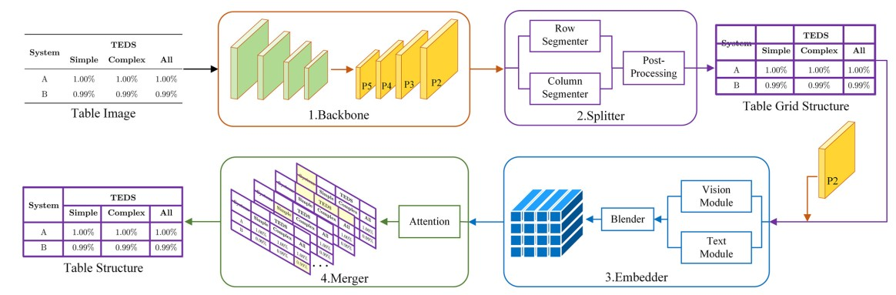

# Split, Embed and Merge: An accurate table structure recognizer  

This repository contains the source code of our Pattern Recognition 2022 paper: [Split, Embed and Merge: An accurate table structure recognizer](https://arxiv.org/abs/2107.05214).

## Introduction



Split, Embed and Merge (SEM) is a framework for parsing tabular data into a structured format, originally composed of three components: splitter, embedder, and merger. SEM achieved first place for complex tables and third place overall in Task-B of the ICDAR 2021 Competition on Scientific Literature Parsing. In this project, we have modified some directories and configurations to enable training on custom data.


## Training and Testing

```shell
python runner/train.py --cfg default
```
# Reference:

Zhang, Z., Zhang, J., Du, J., & Wang, F. (2022).
Split, embed and merge: An accurate table structure recognizer.
Pattern Recognition, 126, 108565.